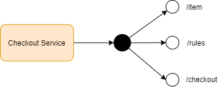

# Checkout Use Case

Nextail is thinking about expanding its business and not only forecast sales in the stores but
also manage the cash register. The first store where we will introduce our software will sell the
following 3 products.

| CODE | NAME | PRICE |
| --- | --- | --- |
| VOUCHER | Gift Card | 5.00€ |
| TSHIRT | Summer T-Shirt | 20.00€ |
| PANTS | Summer Pants | 7.50€ |

The different departments have agreed the following discounts:

- A 2-for-1 special on VOUCHER items.
- If you buy 3 or more TSHIRT items, the price per unit should be 19.00€.
- Items can be scanned in any order, and the cashier should return the total amount to be
paid.

The interface for the checkout process has the following specifications:

- The Checkout constructor receives a pricing_rules object
- The Checkout object has a scan method that receives one item at a time

Examples:

- Items: VOUCHER, TSHIRT, PANTS - Total: 32.50€
- Items: VOUCHER, TSHIRT, VOUCHER - Total: 25.00€
- Items: TSHIRT, TSHIRT, TSHIRT, VOUCHER, TSHIRT - Total: 81.00€
- Items: VOUCHER, TSHIRT, VOUCHER, VOUCHER, PANTS, TSHIRT, TSHIRT - Total: 74.50€

# Checkout Solution

This is a demo solution to provide a basic Demo of Checkout API. This API is composed of two resources:

- **Item**: It provides information about items available in the inventory and allows to add new items.
- **Checkout**: It provides the operational checkout process to the nextail demo stores.

## Architecture Diagram




## Requirements & Features

This service is designed following:

1. This is a standalone service. It doesn't work in a distributed environment.
2. The persistence layer is not durable. It is based on the java bean repository.
3. JDK 11.
4. Open API 3.0.0 specification.
5. Spring Boot.
6. Following SOLID principles.

## Open API specification

http://localhost:8080/swagger-ui/index.html?configUrl=/v3/api-docs/swagger-config#/

## How to
### Run Appliction

```
mvn spring-boot:run
```
### Basic flow

The main rules and item are loaded automatically in the startup process:

1. Get Rules

```
curl -X 'GET' 'http://localhost:8080/rules/' -H 'accept: application/json'
```
2. Get Items

```
curl -X 'GET' 'http://localhost:8080/item/' -H 'accept: application/json'
```

3. Put Items to Cart. RFID it is the parameter to identify the item, we want to add to the cart.

```
curl -X 'POST' \
  'http://localhost:8080/checkout/items/' \
  -H 'accept: */*' \
  -H 'Content-Type: text/plain' \
  -d '44c67bf9-a247-4bb6-bfb4-8c6f09b71286'
```

4. Get the preview order to show the total amount and total amount with discount.

```
curl -X 'GET' \
  'http://localhost:8080/checkout/previeworder/' \
  -H 'accept: application/json'
```